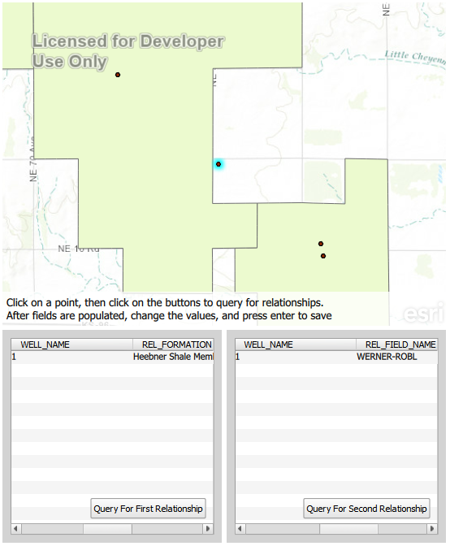

# ORE README#
ORE (ONLINE RELATIONSHIP EDITOR)



This sample application demonstrates the customizability of ArcGIS AppStudio.
This app allows the user to perform online relationship editing
using feature services that has both feature to table relations and feature to feature relations.

## Setup
1. Create a new blank project in ArcGIS AppStudio
2. Launch QtCreator (AppStudio)
3. Copy ContentBLock.qml into your application
4. Replace the contents of your main.qml(or empty.qml) file with the contents of MyApp.qml
5. Save, and run the App through AppStudio

## Known Limitations
1. Plain table updates are not working, due to a possible API bug. Feature service updates are working.
2. Table scroll not working on mobile devices

## Key Concepts

#### Check for Relationships####
```
var relationships = wellsFeatureServiceTable.relationships
```

#### Query for Related Records####
```
QueryTask{
	id: relationshipQueryTask
	onRelationshipQueryErrorChanged: {
		...
	}
	onRelationshipQueryTaskStatusChanged: {
		...
	}
	onRelationshipQueryResultChanged: {
		...
	}
}


QueryRelatedRecordsParameters{
	id: relatedQueryParam
}

var inIDList = [selectedFeatureId]
var outFieldsList = ["OBJECTID", "FORMATION" , "SOURCE"];

//setup the parameters
relatedQueryParam.objectIds = inIDList
relatedQueryParam.relationshipId = relationships[queryindex].relationshipId
relatedQueryParam.returnGeometry = false
relatedQueryParam.outFields = outFieldsList

//setup and run the query task
relationshipQueryTask.url = wellsFeatureServiceTable.url
relationshipQueryTask.executeRelationshipQuery(relatedQueryParam)

```


#### Obtain Related Records####
```
onRelationshipQueryResultChanged: {
	if(relationshipQueryTaskStatus == Enums.RelationshipQueryTaskStatusCompleted){
		var graphics = relationshipQueryResult.relatedRecordGroups[0].graphics;

		//obtain an attribute name
		var name = relationshipQueryResult.relatedRecordGroups[0].graphics[0].attributeNames[0]
		//obtain an attribute value
		var value = relationshipQueryResult.relatedRecordGroups[0].graphics[0].attributes[name]
	}
}
```

#### Update Value####
```
var feat = wellsFeatureServiceTable.feature(id)
feat.setAttributeValue(fieldName, value)
wellsFeatureServiceTable.updateFeature(id,feat)
wellsFeatureServiceTable.applyFeatureEdits()
```


## Resources
[QML Relationship Reference](https://developers.arcgis.com/qt/qml/api-reference/class_relationship.html)

[QML GeodatabaseFeatureServiceTable Reference](https://developers.arcgis.com/qt/qml/api-reference/class_geodatabase_feature_service_table.html)

[QML QueryTask/Relationship QueryTask Reference](https://developers.arcgis.com/qt/qml/api-reference/class_query_task.html)

[QML QueryRelatedRecordsParameters Reference](https://developers.arcgis.com/qt/qml/api-reference/class_query_related_records_parameters.html)

### Author
* Andrew Wang
